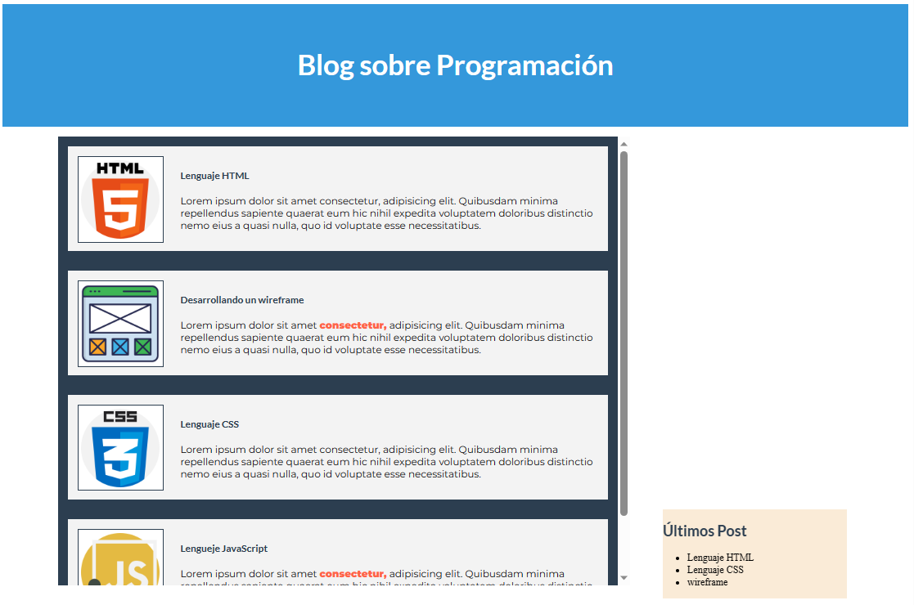

# Clase 06 - Box Model

- Elementos de Bloque y de línea
- Display: block y display: inline-block
- margin, padding, border
- float: left y float:right

## Recursos
- [HTML iconos creados por Freepik - Flaticon](https://www.flaticon.es/iconos-gratis/html-5)
- [CSS iconos creados por Freepik - Flaticon](https://www.flaticon.es/iconos-gratis/css)
- [Estructura metálica iconos creados por Talha Dogar - Flaticon](https://www.flaticon.es/iconos-gratis/estructura-metalica)
- [Javascript iconos creados por Freepik - Flaticon](https://www.flaticon.es/iconos-gratis/javascrip)

